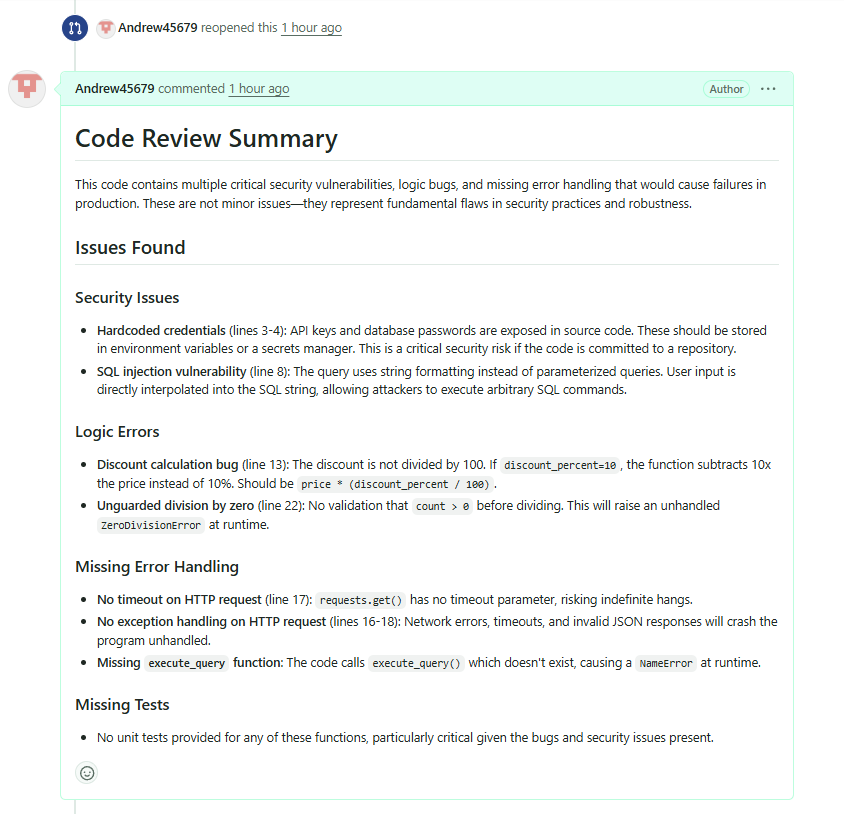

# serverless-code-review-bot

## Overview
A serverless bot that automatically reviews GitHub pull requests using Claude on Amazon Bedrock. When a PR is opened or updated, the bot fetches the diff, sends it to Claude for review, and posts the findings back as a PR comment.

## Features
- Triggers automatically on GitHub `pull_request` events (opened, reopened, synchronize)
- Verifies webhook authenticity via HMAC signature before processing anything
- Fetches the PR diff directly from the GitHub API
- Sends the diff to Claude (via Bedrock) using a configurable prompt template
- Posts the AI's review as a comment on the PR
- Fully serverless — API Gateway + Lambda, no servers to manage

## File Structure
serverless-code-review-bot/
┌── src/
│   ├── prompts/
│   │   └── review_prompt.txt    # Prompt template sent to Claude; {diff} gets substituted in
│   ├── bedrock_client.py        # Calls Bedrock's InvokeModel API, returns Claude's review text
│   ├── db_client.py             # Data storage client
│   ├── github_client.py         # Fetches PR diffs and posts review comments via GitHub's API
│   ├── handler.py               # Lambda entry point
│   ├── requirements.txt         # Python dependencies for the Lambda
│   └── webhook_verify.py        # Verifies GitHub's HMAC webhook signature
├── tests/
│   └── test_webhook_verify.py   # Unit tests for signature verification
├── .gitignore
├── LICENSE
├── README.md 
└── template.yaml                # SAM/CloudFormation template — defines the Lambda, API Gateway, IAM policy


## Installation

### Prerequisites
- AWS account with Bedrock model access enabled for the model you plan to use
- AWS SAM CLI installed
- Python 3.14 installed locally (matching the Lambda runtime in `template.yaml`)
- A GitHub repo to test against, and a GitHub personal access token with permission to read PRs and post comments

### Deploy
```bash
git clone https://github.com/Andrew45679/serverless-code-review-bot.git
cd serverless-code-review-bot
sam build
sam deploy --guided
```

## Example Output
Below is a real review generated on a test PR containing several intentionally 
planted issues (hardcoded credentials, SQL injection, an off-by-one discount 
bug, unguarded division by zero, and missing error handling).



The bot correctly identified every planted issue, plus one it wasn't told 
about — a call to a function (`execute_query`) that was never defined.

## Future Work
- Add retry logic around the Bedrock call in case of throttling
- Tune `review_prompt.txt` for the team's specific priorities (security, style, performance, etc.)
- Skip auto-generated files, lockfiles, and test fixtures in the diff sent to Claude
- Post inline review comments on specific lines instead of one summary comment
- Narrow the Bedrock IAM policy from `Resource: "*"` to the specific inference profile ARN in use
- Move secrets to AWS Secrets Manager instead of CloudFormation parameters
- Add structured logging and a CloudWatch alarm on Lambda error rate
- Support a per-repo config file (`.review-bot.yml`) to customize what the bot checks for

## Technologies Used
- AWS Lambda
- AWS API Gateway
- AWS Bedrock (Claude)
- AWS SAM
- Python 3.14
- GitHub REST API / Webhooks